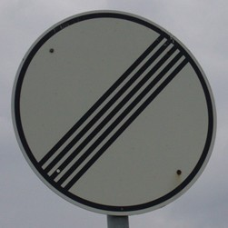

# **Traffic Sign Recognition**


The goals / steps of this project are the following:
* Load the data set (see below for links to the project data set)
* Explore, summarize and visualize the data set
* Design, train and test a model architecture
* Use the model to make predictions on new images
* Analyze the softmax probabilities of the new images
* Summarize the results with a written report

---
### Data Set Summary & Exploration

##### Provide a basic summary of the data set. In the code, the analysis should be done using python, numpy and/or pandas methods rather than hardcoding results manually.

```python
# Number of training examples
n_train = X_train.shape[0]
# Number of validation examples
n_validation = X_valid.shape[0]
# Number of testing examples.
n_test = X_test.shape[0]
# What's the shape of an traffic sign image?
image_shape = X_train.shape[1:]
# How many unique classes/labels there are in the dataset.
n_classes = len(set(y_train))

print("Number of training examples =", n_train)
print("Number of testing examples =", n_test)
print("Image data shape =", image_shape)
print("Number of classes =", n_classes)
```
The output is:
```
Number of training examples = 34799
Number of testing examples = 12630
Image data shape = (32, 32, 3)
Number of classes = 43
```
##### Include an exploratory visualization of the dataset.
Here is an exploratory visualization of the data set. It is a bar chart showing how data is distributed across classes.
```python
# Calculate the class distribution
class_distribution = []
for c in set(y_train):
    class_distribution.append([c, y_train[y_train==c].shape[0]])
class_distribution = np.array(class_distribution)
# plot it in a bar plot
plt.bar(class_distribution[:,0], class_distribution[:,1])
```
Output:


As you can see the data is not equally distributed across the classes. This could bias our model, we should augment the dataset in the less populated classes. Ideally this histogram would be flat.

---
### Design and Test a Model Architecture

##### Preprocess the image data
I decided to just normalize the data around 0 and in the range (-1, 1). It is not a preprocess of the images, it is added at the beginning of the model. To normalize the data added to initialize the variables randomly around 0 makes the optimizer converge faster.
```python
def preprocess(x):
    ### Preprocess steps
    # check https://www.tensorflow.org/api_docs/python/tf/image
    # gray = tf.image.rgb_to_grayscale(x)
    normalize = tf.divide(tf.subtract(x, 128.0), 128.0)
    return normalize

n_channels = 3  # 1 if converted to grayscale
```

##### Model architecture
The base architecture was Lenet-5.
In the first iteration I increased the size of every layer.
Then I added an extra convolutional layer and adjust the sizes.
At the end I tried connecting the second convolutional layer to the fully connected layers which had the third convolutional layer already connected.
My final model consisted of the following layers:

| Layer         		|     Description	          					 	                				    			 | Input             | Output            |
|:------------------|:-------------------------------------------------------------------------|:-----------------:|:-----------------:|
| Preprocess     		| 32x32x3 RGB image. Pixels [-1, 1]                                     	 | 32x32x3  [0, 255] | 32x32x3  [-1, 1]  |
|  |  |  |  |
| Convolutional 1		| kernel=5x5, n_filter=6, stride=[1,1], padding='VALID', activation=relu 	 | 32x32x3           | 28x28x6           |
| Polling 1     		| kernel=2x2, stride=[2,2], padding='VALID'                              	 | 28x28x6           | 14x14x6           |
| Convolutional 2		| kernel=5x5, n_filter=16, stride=[1,1], padding='VALID', activation=relu  | 14x14x6           | 10x10x16          |
| Polling 2     		| kernel=2x2, stride=[2,2], padding='VALID'                             	 | 10x10x16          | 5x5x16            |
| Convolutional 3		| kernel=5x5, n_filter=400, stride=[1,1], padding='VALID', activation=relu | 5x5x16            | 1x1x400           |
|  |  |  |  |
| Flatten poll 2    | Flatten the output of "Polling 2"                                        | 5x5x16            | 1x400             |
| Flatten conv 3    | Flatten the output of "Convolutional 3"                                  | 1x1x400           | 1x400             |
|  |  |  |  |
| Concatenate       | Concatenate the outputs of "Flatten poll 2" and "Flatten conv 3"         | [1x400, 1x400]    | 1x800             |
|  |  |  |  |
| Dropout           |                                                                          |                   |                   |
| Fully connected 1 | activation=relu                                                          | 1x800             | 1x400             |
| Dropout           |                                                                          |                   |                   |
| Fully connected 2 | activation=relu                                                          | 1x400             | 1x100             |
| Dropout           |                                                                          |                   |                   |
| Fully connected 3 | activation=relu                                                          | 1x100             | 1x43              |

The code that implements it is:
```python
def nn_arch_v1(x, keep_prob):

    # get the preprocessor step
    p = preprocess(x)

    ### Convolutional layers
    # conv 1 - input 32x32xn_channels - output 28x28x6
    conv1 = convolutonal_layer(p,
                           random_variable((5, 5, n_channels, 6)),
                           zero_variable((6,)),
                           [1, 1, 1, 1],
                           'VALID',
                           tf.nn.relu)

    # poll conv 1 - input 28x28x6 - output 14x14x6
    poll1 = tf.nn.max_pool(conv1, ksize=[1, 2, 2, 1], strides=[1, 2, 2, 1], padding='VALID')

    # conv 2 - input 14x14x6 - output 10x10x16
    # conv 2
    conv2 = convolutonal_layer(poll1,
                           random_variable((5, 5, 6, 16)),
                           zero_variable((16,)),
                           [1, 1, 1, 1],
                           'VALID',
                           tf.nn.relu)
    # poll conv 2 - input 10x10x16 - output 5x5x16
    poll2 = tf.nn.max_pool(conv2, ksize=[1, 2, 2, 1], strides=[1, 2, 2, 1], padding='VALID')

    # conv 3 - input 5x5x16 - output 1x1x400
    # conv 3
    conv3 = convolutonal_layer(poll2,
                           random_variable((5, 5, 16, 400)),
                           zero_variable((400,)),
                           [1, 1, 1, 1],
                           'VALID',
                           tf.nn.relu)


    ### flatten poll 2 - input 5x5x16 - output 1x400
    flatten_poll2 = tf.contrib.layers.flatten(poll2)


    ### flatten conv 3 - input 1x1x400 - output 1x400
    flatten_conv3 = tf.contrib.layers.flatten(conv3)


    ### concat - input1 1x400 - input2 1x400 - output 1x800
    concat = tf.concat([flatten_poll2, flatten_conv3], 1)

    # dropout 1
    concat = tf.nn.dropout(concat, keep_prob)


    ### fully connected nn
    # layer 1 - input 1x800 - output 1x400
    layer1 = fully_connected_layer(concat,
                                   random_variable((800, 400)),
                                   zero_variable((400,)),
                                   tf.nn.relu)

    # dropout 2
    layer1 = tf.nn.dropout(layer1, keep_prob)

    # layer 2 - input 1x400 - output 1x100
    layer2 = fully_connected_layer(layer1,
                                   random_variable((400, 100)),
                                   zero_variable((100,)),
                                   tf.nn.relu)
    # dropout 3
    layer2 = tf.nn.dropout(layer2, keep_prob)

    # layer 3 - input 1x100 - output 1x43
    layer3 = fully_connected_layer(layer2,
                                   random_variable((100, n_classes)),
                                   zero_variable((n_classes,)),
                                   None)

    return layer3
```
Using the functions:
```python
def zero_variable(shape):
    mu = 0
    sigma = 0.1
    return tf.Variable(tf.zeros(shape=shape))

def random_variable(shape):
    mu = 0
    sigma = 0.1
    return tf.Variable(tf.truncated_normal(shape=shape, mean=mu, stddev=sigma))

def convolutonal_layer(x, w, b, strides, padding, activation=None):
    conv = tf.nn.conv2d(x, w, strides=strides, padding=padding)
    conv = tf.nn.bias_add(conv, b)
    if activation:
        conv = activation(conv)
    return conv

def fully_connected_layer(x, w, b, activation=None):
    layer = tf.add(tf.matmul(x, w), b)
    if activation:
        layer = activation(layer)
    return layer
```

##### Training
The loss function is "cross entropy", it averaged across the batch. It is widely used for this kind of tasks.
The optimized is Adam. I will quote liberally from their paper the attractive benefits of using Adam on non-convex optimization problems:

* Straightforward to implement.
* Computationally efficient.
* Little memory requirements.
* Invariant to diagonal rescale of the gradients.
* Well suited for problems that are large in terms of data and/or parameters.
* Appropriate for non-stationary objectives.
* Appropriate for problems with very noisy/or sparse gradients.
* Hyper-parameters have intuitive interpretation and typically require little tuning.

To evaluate the model the mean of the error is used.

```python
### Model evaluation function
def evaluate(x_data, y_data, batch_size):
    # check if predictions are correct
    correct_prediction = tf.equal(tf.argmax(logits, 1), tf.argmax(y_one_hot, 1))
    # calculate the mean after casting to a float32
    accuracy_operation = tf.reduce_mean(tf.cast(correct_prediction, tf.float32))

    # number of samples
    num_examples = len(x_data)
    # to calculate the sum of the accuracy
    total_accuracy = 0
    # get a session to perform the calculation
    sess = tf.get_default_session()
    # run through the data in batches
    for offset in range(0, num_examples, batch_size):
        # slicing the date to get the batches
        accuracy = sess.run(accuracy_operation, feed_dict={x: x_data[offset:offset+batch_size],
                                                           y: y_data[offset:offset+batch_size],
                                                           keep_prob:1.0})
        # update the accuracy
        total_accuracy += (accuracy * len(x_data[offset:offset+batch_size]))
    # return the accuracy
    return total_accuracy / num_examples
```


```python
### Model training function
def train(model, train_data, eval_data, restore=False, **kwargs):

    # get the optimizer
    cross_entropy = tf.nn.softmax_cross_entropy_with_logits(labels=y_one_hot, logits=logits)
    loss_operation = tf.reduce_mean(cross_entropy)
    optimizer = tf.train.AdamOptimizer(learning_rate=kwargs['learning_rate'])
    training_operation = optimizer.minimize(loss_operation)

    # instanciate a saver
    saver = tf.train.Saver()
    # open the session
    with tf.Session() as sess:
        # try to read previously saved model
        if restore:
            try:
                saver.restore(sess, kwargs['save_path'])
            except Exception as e:
                print(e)

        # initialize random variables
        sess.run(tf.global_variables_initializer())
        # number of examples
        num_examples = len(train_data[0])

        # for every epoch
        for i in range(kwargs['epochs']):
            # shuffle the data
            x_train, y_train = shuffle(train_data[0], train_data[1])
            # for every batch in the epoch
            for offset in range(0, num_examples, kwargs['batch_size']):
                # run the optimizer
                sess.run(training_operation, feed_dict={x: x_train[offset:offset+kwargs['batch_size']],
                                                 y: y_train[offset:offset+kwargs['batch_size']],
                                                 keep_prob:kwargs['keep_prob']})
            # calculate accuracy
            validation_accuracy = evaluate(eval_data[0], eval_data[1], kwargs['batch_size'])
            print("EPOCH {} ...".format(i+1))
            print("Validation Accuracy = {:.3f}".format(validation_accuracy))
            print()

        # save the trained model
        saver.save(sess, kwargs['save_path'])
        print("Model saved")
```
Train the model using these parameters:
```python
training_args = {'epochs': 30,
                'batch_size': 500,
                'keep_prob': 0.5,
                'learning_rate':0.001,
                'save_path': './tscn.ckpt'}
```
The output is:
```
EPOCH 1  ...Validation Accuracy = 0.310
EPOCH 2  ...Validation Accuracy = 0.586
EPOCH 3  ...Validation Accuracy = 0.756
EPOCH 4  ...Validation Accuracy = 0.838
EPOCH 5  ...Validation Accuracy = 0.894
EPOCH 6  ...Validation Accuracy = 0.906
EPOCH 7  ...Validation Accuracy = 0.912
EPOCH 8  ...Validation Accuracy = 0.924
EPOCH 9  ...Validation Accuracy = 0.931
EPOCH 10 ...Validation Accuracy = 0.940
EPOCH 11 ...Validation Accuracy = 0.939
EPOCH 12 ...Validation Accuracy = 0.948
EPOCH 13 ...Validation Accuracy = 0.947
EPOCH 14 ...Validation Accuracy = 0.946
EPOCH 15 ...Validation Accuracy = 0.944
EPOCH 16 ...Validation Accuracy = 0.950
EPOCH 17 ...Validation Accuracy = 0.948
EPOCH 18 ...Validation Accuracy = 0.951
EPOCH 19 ...Validation Accuracy = 0.946
EPOCH 20 ...Validation Accuracy = 0.951
EPOCH 21 ...Validation Accuracy = 0.956
EPOCH 22 ...Validation Accuracy = 0.948
EPOCH 23 ...Validation Accuracy = 0.955
EPOCH 24 ...Validation Accuracy = 0.954
EPOCH 25 ...Validation Accuracy = 0.955
EPOCH 26 ...Validation Accuracy = 0.957
EPOCH 27 ...Validation Accuracy = 0.955
EPOCH 28 ...Validation Accuracy = 0.954
EPOCH 29 ...Validation Accuracy = 0.955
EPOCH 30 ...Validation Accuracy = 0.959
```

##### Testing
The loss function is

```python
### Test the model
def test(x_data, y_data, batch_size):
    with tf.Session() as sess:
        # instanciate a saver
        saver = tf.train.Saver()
        saver.restore(sess, './tscn.ckpt')

        test_accuracy = evaluate(x_data, y_data, batch_size)
        print("Test Accuracy = {:.3f}".format(test_accuracy))

test(X_test, y_test, training_args['batch_size'])
```
The output:
```
Test Accuracy = 0.948
```


---
###  Test a Model on New Images

##### New images
These are the images from internet:





##### Model predictions in the new images
They are from the top left to the right:
```
labels      ->  [40  7 17  2 32 14 13 28  1 17 12 14]
predictions ->  [40 40 17  9 32 14 13 28  2 14 12 14]
```
This results produce an accuracy of 66.7% which is not a good accuracy taking into account that the accuracy in the test data was 94.8%. And comparing the images, the ones from internet seem clearer than the ones from the repository.

The softmax probabilities for each prediction are:
[  9.998e-01   1.720e-04   1.443e-05   8.287e-06   4.580-06  ]
[  8.787e-01   7.739e-02   1.366e-02   1.042e-02   5.922e-03 ]
[  1.000e+00   1.824e-10   1.186e-16   2.476e-17   1.724e-18 ]
[  6.887e-01   1.784e-01   8.365e-02   2.719e-02   1.738e-02 ]
[  9.974e-01   7.513e-04   6.988e-04   4.103e-04   3.202e-04 ]
[  1.000e+00   2.934e-08   2.736e-25   1.779e-26   1.468e-28 ]
[  1.000e+00   0.000e+00   0.000e+00   0.000e+00   0.000e+00 ]
[  9.956e-01   2.947e-03   2.803e-04   2.651e-04   2.628e-04 ]
[  7.243e-01   2.756e-01   4.590e-06   1.699e-07   4.219e-09 ]
[  9.999e-01   1.140e-05   2.154e-08   1.080e-09   6.161e-10 ]
[  1.000e+00   6.514e-29   2.975e-32   0.000e+00   0.000e+00 ]
[  9.999e-01   1.196e-07   1.022e-13   3.605e-14   7.068e-15 ]

They are clear in some cases with almost 1 as probability of the first choice. In the cases where the model fails to classify an image the probabilities are  distributed.


---
### Reflection

Deep neural network opens a world of infinite possibilities, infinite architectures and infinite hyper parameters configuration in each architecture. This can lead to an overwhelming number of trial and error attempts every time you want to create a model for a given task.
I think preprocessing a good data quality are the key in deep learning. In this case I did not spend much time in it but to improve the performance I should preprocess more the images and work with the dataset augment it with distorted images, changing the colour scheme, translating and rotating them...
